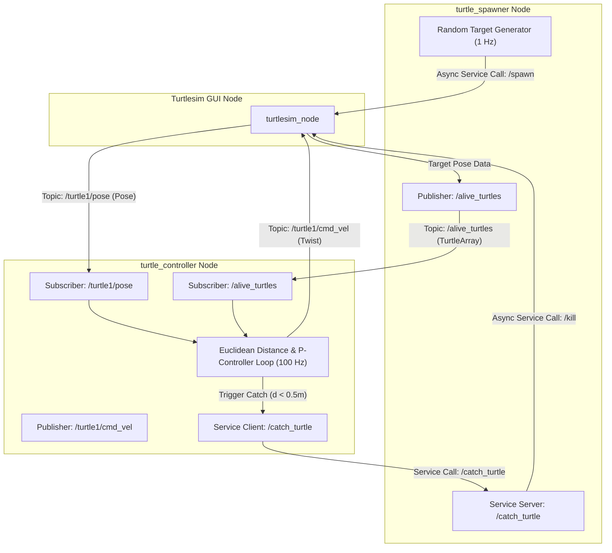

# 🐢 Turtlesim Catch Them All — Autonomous Target Tracking & Hunting System in ROS 2 C++


An autonomous multi-node robotics simulation developed in **ROS 2 C++ (`rclcpp`)**. The system controls a hunter turtle (`turtle1`) that dynamically tracks, chases, and captures randomly spawned target turtles across a 2D environment using **Proportional Control (P-Controller)**, custom ROS 2 interfaces, and asynchronous service calls.

---

## 📸 Overview & Architecture

The application is structured into two decoupled packages adhering to ROS 2 best practices:
1. **`my_robot_interfaces`**: Custom ROS 2 interface package defining target messages (`Turtle.msg`, `TurtleArray.msg`) and catch service definitions (`CatchTurtle.srv`).
2. **`turtlesim_catch_them_all`**: Main robotics package containing the C++ node implementations.

### 🌐 Multi-Node Architecture Diagram



---

## ✨ Key Features & Technical Highlights

- **Custom ROS 2 Interfaces (`my_robot_interfaces`)**:
  - `Turtle.msg`: Contains name, 2D coordinates $(x, y)$, and orientation $\theta$.
  - `TurtleArray.msg`: Dynamic list `Turtle[] turtles` of all active targets.
  - `CatchTurtle.srv`: Asynchronous service protocol (`string name` $\rightarrow$ `bool success`).

- **Autonomous Proportional Controller (P-Controller)**:
  - Real-time 100 Hz control loop executing Euclidean distance calculation:
    $$d = \sqrt{(x_{\text{target}} - x_{\text{hunter}})^2 + (y_{\text{target}} - y_{\text{hunter}})^2}$$
  - Linear velocity control: $v = K_{p\_linear} \cdot d$
  - Angular velocity steering: $\omega = K_{p\_angular} \cdot \Delta \theta$ using `std::atan2`.

- **Asynchronous Service Clients & Servers**:
  - Non-blocking ROS 2 service requests (`async_send_request`) for `/spawn`, `/kill`, and `/catch_turtle`.

- **Dynamic ROS 2 Parameters**:
  - Live runtime gain tuning without recompilation:
    ```bash
    ros2 param set /turtle_controller Kp_linear 3.5
    ros2 param set /turtle_controller Kp_angular 8.0
    ```

---

## 🛠️ Build & Installation

### Prerequisites
- Ubuntu 22.04 LTS
- ROS 2 Humble Hawksbill
- C++17 Compiler & `colcon`

### Build Instructions

```bash
# Clone the repository
git clone https://github.com/MaartyHL/ROS2-Catch-Them-All.git
cd ROS2-Catch-Them-All

# Build the workspace
colcon build

# Source the setup script
source install/setup.bash
```

---

## 🚀 How to Run

Launch the 3 nodes in separate terminal windows:

### Terminal 1: Launch Turtlesim GUI
```bash
ros2 run turtlesim turtlesim_node
```

### Terminal 2: Launch Target Spawner
```bash
source install/setup.bash
ros2 run turtlesim_catch_them_all turtle_spawner
```

### Terminal 3: Launch Autonomous Hunter Node
```bash
source install/setup.bash
ros2 run turtlesim_catch_them_all turtle_controller
```

---

## 👤 Author

**Martin** — Autonomous Robotics Engineering Student at Polytech Nice Sophia.
- GitHub: [@MaartyHL](https://github.com/MaartyHL)
