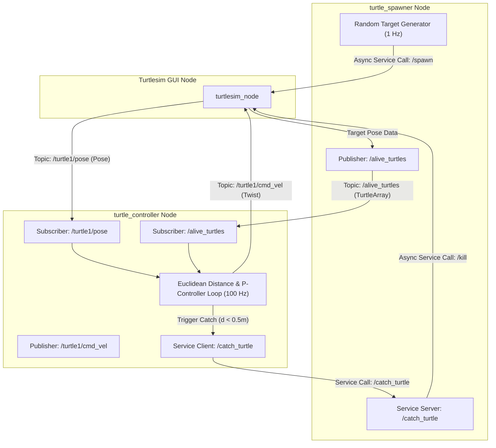

# 🎓 ROS 2 C++ Master Learning Journey & Robotics Projects


A complete, structured curriculum and repository documenting my journey mastering **ROS 2 in C++ (`rclcpp`)**. The repository transitions from absolute foundational concepts to advanced autonomous robotics control systems and safety regulators.

---

## 📂 Repository Structure & Project Roadmap

```
ROS2-Learning-Journey/
│
├── 📜 README.md                               <── Master Summary & Roadmap
├── 📜 .gitignore                              <── Build artifacts filter
│
├── 🎓 Entrainement/                           <── Core Middleware Fundamentals
│   ├── 00_le_noeud_bavard/                    <── Minimal Node & Timers
│   ├── 01_noeud_compteur/                     <── State & Dynamic Parameters
│   ├── 02_chauffeur_de_tortue/                <── Publishers & Twist Commands
│   ├── 03_observateur_pose/                   <── Subscribers & Telemetry
│   ├── 04_moniteur_batterie/                  <── Real-Time Battery Monitor
│   └── 06_safety_stop/                        <── Autonomous Safety Stop Regulator
│
└── 🐢 ROS2 catch_them_all/                    <── Advanced Multi-Node System
    ├── src/my_robot_interfaces/               <── Custom .msg and .srv
    └── src/turtlesim_catch_them_all/          <── Autonomous P-Controller
```

---

## 🛠️ Project Summaries

### 1️⃣ Core Practice Projects (`Entrainement/`)
- **00 Nœud Bavard**: Node lifecycle, 1s `create_wall_timer`, `RCLCPP_INFO` logging.
- **01 Nœud Compteur**: Internal state mutation, dynamic ROS 2 parameters (`declare_parameter`), runtime modification (`ros2 param set`).
- **02 Chauffeur de Tortue**: `cmd_vel` velocity publisher (`geometry_msgs/msg/Twist`), dual parameter linear/angular speed tuning.
- **03 Observateur de Pose**: Topic subscription (`/turtle1/pose`), telemetry callbacks, accessing `turtlesim::msg::Pose` pointer fields.
- **04 Moniteur de Batterie**: Real-time state thresholding node with dynamic alert levels (`seuil_alerte`) and `RCLCPP_WARN` logging.
- **06 Régulateur de Sécurité**: Obstacle distance monitoring (`std_msgs/msg/Float32`), dynamic emergency stopping (`RCLCPP_ERROR`), slow-down zone management (`RCLCPP_WARN`), and velocity output (`geometry_msgs/msg/Twist`).

### 2️⃣ Advanced Capstone System (`ROS2 catch_them_all/`)
- **Custom ROS 2 Interfaces**: `Turtle.msg`, `TurtleArray.msg`, `CatchTurtle.srv`.
- **Target Spawner Node**: Random spatial distribution, non-blocking asynchronous service clients (`/spawn`, `/kill`), target tracking publishing.
- **Autonomous Hunter Controller**:
  - Real-time 100 Hz control loop executing Euclidean distance calculation:
    $$d = \sqrt{(x_{\text{target}} - x_{\text{hunter}})^2 + (y_{\text{target}} - y_{\text{hunter}})^2}$$
  - Linear velocity control: $v = K_{p\_linear} \cdot d$
  - Angular velocity steering: $\omega = K_{p\_angular} \cdot \Delta \theta$ using `std::atan2`.

---

## 🎯 System Architecture Diagram (Catch Them All Capstone)



---

## 👤 Author

**Martin** — Autonomous Robotics Engineering Student at Polytech Nice Sophia.
- GitHub: [@MaartyHL](https://github.com/MaartyHL)
